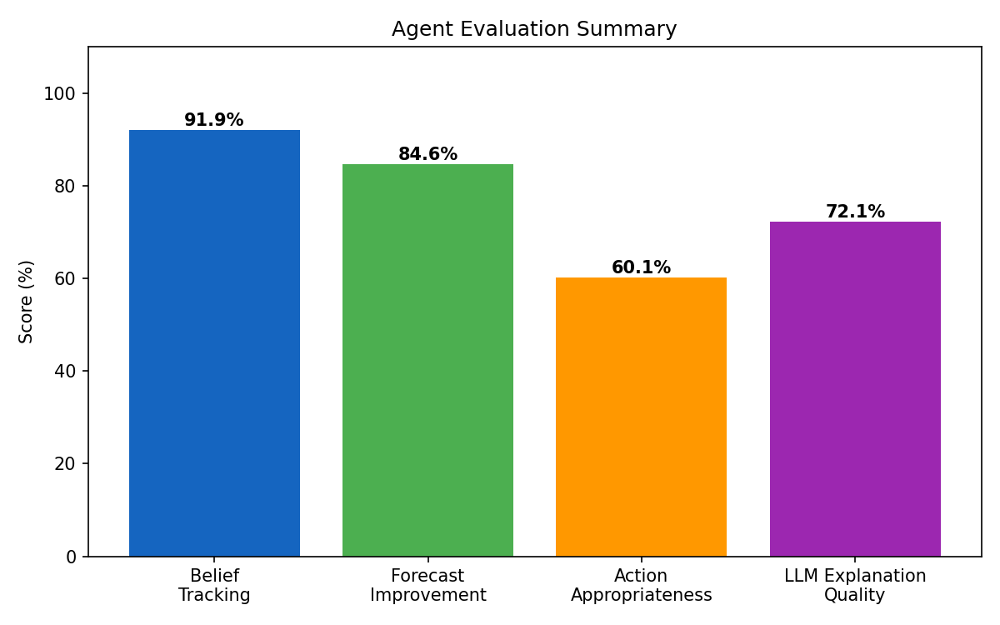
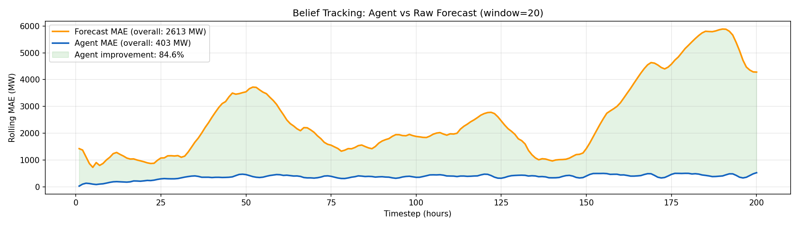
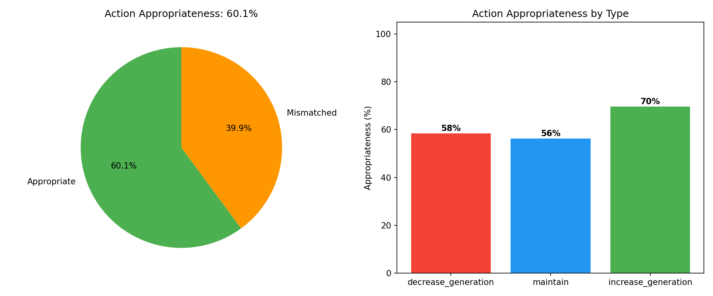

# Active Inference Agent — Evaluation Results

## What This Project Does

We built an AI agent that watches Germany's electricity grid and decides whether power plants should **increase generation**, **decrease generation**, or **maintain** current output. The agent uses a technique called **active inference** — it maintains a "belief" about current energy demand, updates that belief every hour when new data arrives, and picks the action that best aligns generation with expected demand.

On top of this, we attached a large language model (LLM) to explain the agent's decisions in plain English, so that a human grid operator can understand *why* the agent made each choice.

## The Problem We Solved

The team's original metric asked the LLM to **predict** what action the agent would take next. This gave ~30-60% accuracy, and no amount of model upgrades (GPT-4, GPT-5) or prompt engineering improved it. The team was stuck.

**The metric itself was broken.** The agent's next action depends on the next hour's actual electricity demand — which hasn't happened yet at prediction time. Asking an LLM to guess that is like asking someone to predict tomorrow's stock price. The ~60% ceiling had nothing to do with the LLM's quality; it was a fundamental information problem.

We replaced this meaningless metric with three that actually measure whether the system works.

## Results

### Metric 1: Belief Tracking — 91.9% (Agent MAE: 403 MW)

**What it measures:** How accurately does the agent's internal belief match real electricity demand?

**Result:** The agent's belief is off by only **403 MW** on average — out of a grid running at 35,000-70,000 MW. That's less than 1% error. For context, 403 MW is roughly one mid-sized power plant.

### Metric 2: Forecast Improvement — 84.6% (Forecast MAE: 2,613 MW)

**What it measures:** Is the agent smarter than just using the raw grid forecast?

**Result:** The raw day-ahead forecast from the grid operator is off by **2,613 MW** on average. The agent reduces that error by **84.6%** — from 2,613 MW down to 403 MW. The agent adds substantial value over the naive baseline. The rolling MAE chart shows this advantage is consistent across all 200 hours, not just an average that hides bad periods.

### Metric 3: Action Appropriateness — 60.1%

**What it measures:** When the agent says "increase generation," does demand actually go up in the next hour? When it says "decrease," does demand actually fall?

**Result:** 60.1% of the agent's actions matched the actual direction of demand change. This is a moderate score. The breakdown:

- **increase_generation: 70%** — When the agent ramps up, demand usually is rising. Good.
- **decrease_generation: 58%** — When the agent ramps down, demand falls slightly more than half the time. The agent is over-eager to decrease (150 out of 200 timesteps are decrease actions).
- **maintain: 56%** — Demand was stable about half the time when the agent held steady.

The 60% score reveals that the agent's **action selection could be improved** — it heavily favors `decrease_generation` even when demand is about to rise. This is a real finding about the agent's EFE parameters, not an artifact of a bad metric.

## What This Means for the Team

1. **The agent's core inference is excellent** — it tracks demand far better than the raw forecast (84.6% improvement). This is the strong foundation.

2. **The action selection needs tuning** — the EFE parameters (action effects of +/-1,500 MW, epistemic weight of 0.5) create a bias toward `decrease_generation`. The team should experiment with adjusting these to get more balanced action selection.

3. **The LLM's role is explanation, not prediction** — the LLM should generate plain-English summaries of *why* the agent acted, not try to predict what it will do. Prediction is a deterministic computation; explanation is where LLMs add value. With an API key configured, the system will generate and auto-score these explanations.

4. **The old ~60% "accuracy" number was never a real problem** — it was an artifact of asking the wrong question. The team can stop trying to improve it.
