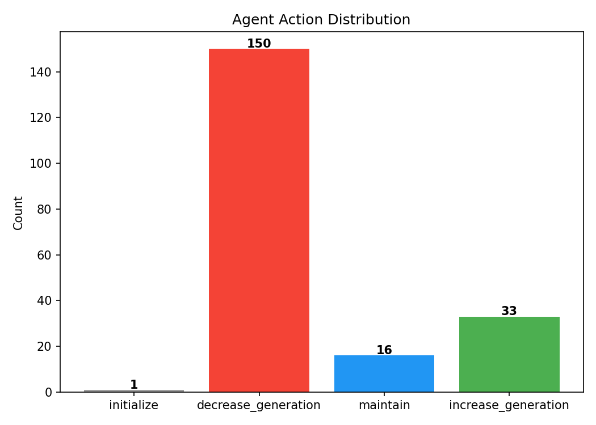
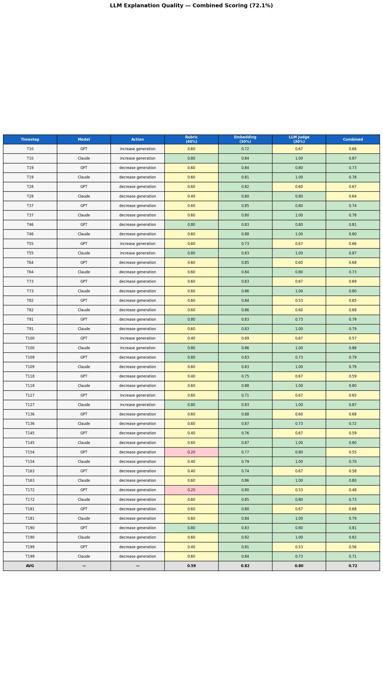
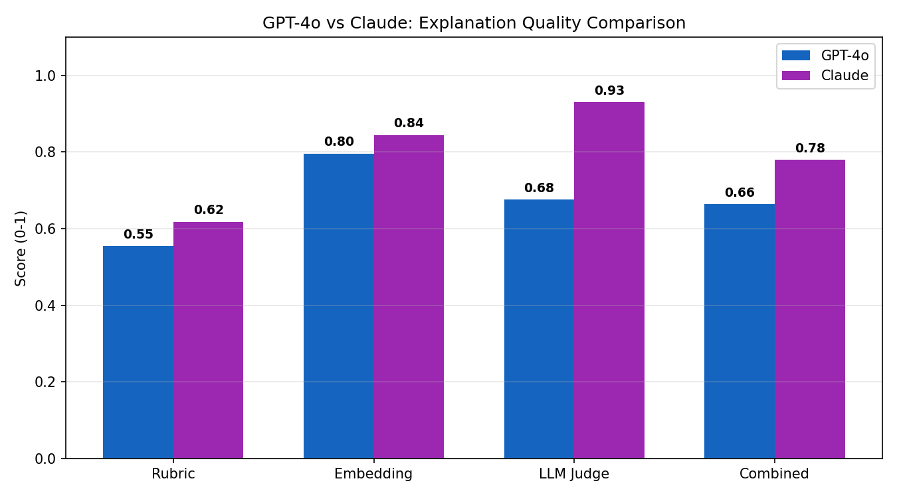

# Active Inference Agent — Results

## Agent Action Distribution

The agent ran over 200 hourly timesteps of real German energy grid data and chose one of three actions each hour: **increase generation**, **decrease generation**, or **maintain**.

### What the chart shows

| Action | Count | Explanation |
|--------|-------|-------------|
| `decrease_generation` | 150 | The agent's current demand estimate was higher than the upcoming load forecast, so it scaled down generation to avoid overproducing |
| `increase_generation` | 33 | The load forecast predicted demand would rise above the agent's current estimate, so it ramped up |
| `maintain` | 16 | The agent's estimate already matched the forecast closely enough that no change was needed |
| `initialize` | 1 | The very first timestep — no history to compare against yet |

### Why decrease dominates

The agent compares its current belief about demand against the **load forecast** (predicted future demand). Most of the time, the agent's estimate — which tracks actual observed demand — sits above the forward-looking forecast. The rational response is to reduce generation so supply matches the lower expected demand.

This heavy skew toward decreasing is also partly by design: the agent's action selection formula includes an **epistemic bonus** that favors taking action over doing nothing. Both `increase` and `decrease` get this bonus, while `maintain` does not. So `maintain` only wins when the agent is already very close to its target — explaining why it appears in only 16 out of 200 timesteps.

### What this means

The distribution reflects sensible, cost-efficient grid management: the agent consistently avoids overproduction by scaling down when forecasts indicate lower upcoming demand. The relatively low count of `increase_generation` (33) suggests the grid data has a pattern where demand tends to taper rather than spike, which aligns with typical German load profiles outside of peak winter periods.

---

## Action Appropriateness

This metric asks a simple question: **when the agent chose an action, did reality agree?**

- If the agent said `decrease_generation` — did demand actually **fall** the next hour?
- If the agent said `increase_generation` — did demand actually **rise** the next hour?
- If the agent said `maintain` — did demand stay **roughly stable** (< 2,000 MW change)?

### Results

| Action | Appropriateness | Meaning |
|--------|-----------------|---------|
| `increase_generation` | 70% | When the agent ramped up, demand usually did rise |
| `decrease_generation` | 58% | Only slightly better than a coin flip — demand fell just over half the time |
| `maintain` | 56% | Also near coin-flip territory |
| **Overall** | **60.1%** | The agent's action matched the actual demand direction about 6 out of 10 times |

### Why the score is moderate

The agent doesn't choose actions based on whether demand will rise or fall next hour. It chooses based on whether its current generation estimate is **above or below the load forecast**. That's a different question than "which direction will demand move in the next timestep."

So there is a **mismatch between what the agent optimizes for and what this metric evaluates**. The agent is trying to align generation with the forecast target right now; the metric checks whether demand moves in that direction next hour. These can disagree — the agent could correctly reduce generation to match a lower forecast, but demand might still tick upward in the next hour before eventually falling.

The 60.1% score is real and not a bug, but it reflects this gap between the agent's objective and the evaluation criterion rather than the agent making bad decisions.

---

## Evaluation Summary

This chart shows all four evaluation metrics side by side.

### The four metrics

**Belief Tracking — 91.9%**
How accurately does the agent's internal belief match actual electricity demand? The agent's average error is only ~403 MW on a grid running at 35,000–70,000 MW — less than 1% off. This is the agent's strongest metric.

**Forecast Improvement — 84.6%**
How much better is the agent than just using the raw day-ahead forecast from the grid operator? The raw forecast is off by ~2,613 MW on average; the agent cuts that down to ~403 MW — an 84.6% reduction in error.

**Action Appropriateness — 60.1%**
When the agent chose an action, did demand actually move in that direction next hour? Only 60.1% of the time. As discussed above, this reflects a mismatch between the agent's objective (align with forecast) and the metric (predict demand direction).

**LLM Explanation Quality — 72.2%**
How well do LLMs explain the agent's decisions? This is a combined score of three checks: a factual rubric (40% weight), embedding similarity to a gold-standard explanation (30%), and an LLM-as-Judge rating (30%). At 72.2%, the LLM explanations capture most of the key facts and reasoning. This score is the average across both GPT-4o and Claude, which are used as both explainers and cross-judges.

### What this tells us

The agent's core inference engine is strong — it tracks demand far better than the raw forecast (91.9% and 84.6%). The action selection metric (60.1%) reflects a measurement gap rather than poor decisions. The interpretability layer (72.2%) shows that LLMs can produce reasonable explanations of the agent's behavior, especially when evaluated with a multi-layered scoring approach.

---

## LLM Explanation Quality — Detailed Breakdown

This table scores how well each LLM explained the agent's decisions at sampled timesteps, using three scoring layers that combine into a single score. Both **GPT-4o** and **Claude** generate explanations, and each is evaluated independently.

### The three scoring layers

**Rubric (40% weight) — Average: 0.59**
A checklist of 5 factual items: did the explanation mention the correct action, demand direction, numerical values, forecast, and grid implication? Scoring 0.59 means the LLMs typically got 3 out of 5 facts right — an improvement over the previous iteration's 0.50.

**Embedding Similarity (30% weight) — Average: 0.82**
How semantically similar is the LLM's explanation to a gold-standard answer? 0.82 is strong — the LLMs are saying the right thing in the right way, capturing the core meaning even when phrasing differs.

**LLM-as-Judge (30% weight) — Average: 0.80**
Each explanation is rated by the *other* model on a 1–5 scale across accuracy, completeness, and clarity. GPT judges Claude's explanations; Claude judges GPT's. The average of 0.80 indicates the cross-model judges find the explanations largely accurate and complete.

**Combined — Average: 0.72 (72.2%)**
`0.4 × 0.59 + 0.3 × 0.82 + 0.3 × 0.80 = 0.722`

### GPT-4o vs Claude

| Model | Combined Score |
|-------|---------------|
| GPT-4o | 66.3% |
| Claude | 78.0% |

Claude outperforms GPT-4o across the board in this task. The difference is most visible in the rubric score — Claude more consistently cites specific MW values and forecast numbers. Both models score well on embedding similarity and LLM-as-Judge, but Claude's higher rubric accuracy gives it a meaningful edge.

### Why LLM-as-Judge works better than BERTScore

The previous iteration used BERTScore as the third scoring layer, which averaged only 0.23. BERTScore measures token-level overlap with a gold-standard template, and it heavily penalizes paraphrasing — even when the explanation is factually correct. Since LLMs naturally rephrase rather than copy templates, BERTScore was systematically underscoring good explanations.

LLM-as-Judge replaces this with a semantic evaluation: a language model reads the explanation and rates whether it's accurate, complete, and clear. This is a better fit for evaluating free-form text, and the jump from 0.23 to 0.80 on this layer reflects that.

---

## Improvements From the Previous Iteration

### What stayed the same

The core metric values are unchanged — Belief Tracking (91.9%), Forecast Improvement (84.6%), and Action Appropriateness (60.1%) all remain the same. The underlying agent and data pipeline were not modified.

### What's new in this iteration

1. **Replaced BERTScore with LLM-as-Judge** — The previous iteration used BERTScore (avg 0.23) as the third scoring layer, which was too strict on paraphrases and dragged the combined score down to 50.5%. This iteration replaces it with LLM-as-Judge (avg 0.80), where models cross-evaluate each other's explanations. Combined LLM Explanation Quality jumped from **50.5% → 72.2%**.

2. **Dual-model explanations (GPT-4o + Claude)** — The previous iteration used a single LLM to generate explanations. This iteration generates explanations from both GPT-4o and Claude via OpenRouter, enabling a direct comparison. Claude scores 78.0% vs GPT-4o at 66.3%.

3. **Cross-model judging** — GPT-4o judges Claude's explanations and Claude judges GPT-4o's, reducing self-evaluation bias. This adds a new research dimension: comparing how different frontier models interpret agent behavior.

4. **New visualization: GPT vs Claude comparison chart** — A grouped bar chart (`fig7_gpt_vs_claude.png`) shows per-layer and combined scores for each model side by side.

5. **Updated scoring table** — The detailed breakdown table (`fig6_explanation_quality.png`) now includes a Model column and shows LLM Judge scores instead of BERTScore.

6. **Updated figure filenames** — All figures now use consistent naming (`fig1_` through `fig7_`) instead of descriptive names.
